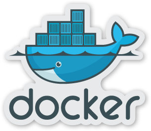

Introduction
============

Docker 作為這兩年火紅的虛擬化技術，不再像 VM 只是提供測試環境，是真的能夠使用在開發流程上，以及作為 production環境實際運作。

透過此講義讓讀者可以理解一個專案如何透過 docker 讓開發環境保持一致，並且讓所有的環境皆可以使用。

閱讀須知
--------

講義內的 sample 皆以 ubuntu 作為 OS 操作。

### 適合對象

適合對開發流程自動化感興趣的 IT 從業人員，或是導入敏捷開發卻無法敏捷的團隊學習，適合不排斥在 Linux 命令列輸入指令的人，因為大部份自動化程序都需要透過命令列輸入指令執行。

版權所有：[創科資訊股份有限公司](http://trunk-studio.com/)
