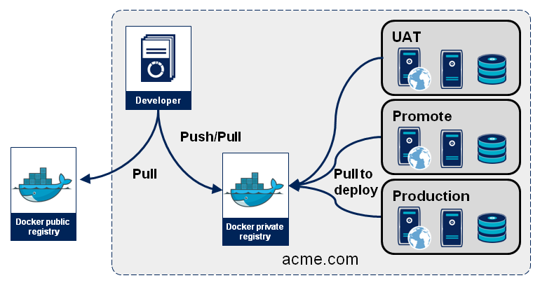

使用 docker hub
===============



本機登入
--------

```
docker login -e smlsun.xie@gmail.com -p jenkins4ever -u trunkworkshopjenkins
```

push 建置好的 image
-------------------

```
docker push trunkworkshop/nodejssample:latest
```

與 github 連結使用 dockerfile auto build
----------------------------------------
