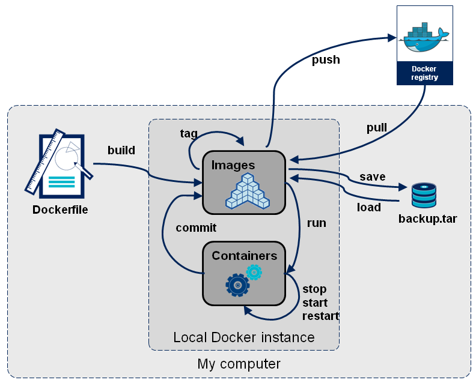

基本結構
========



images
------

docker pull ${image name}

將會下載 images 從 [docker hub](https://hub.docker.com/) 取得

接著就可以利用 docker images 查詢目前已經有抓下來的 images 有哪些

假設，我們 pull ubuntu 14.04 下來，指令如下：

`docker pull ubuntu 14.04:latest`

一旦執行完以後，可以執行 `docker images` 看看有什麼資訊，呈現如下：

```
REPOSITORY          TAG                 IMAGE ID            CREATED             VIRTUAL SIZE
ubuntu              14.04               a5a467fddcb8        11 days ago         187.9 MB
```

history
-------

我們可以下 `docker history a5a467fddcb8` 來看看此 image 相關的建置資訊，如下：

```
IMAGE               CREATED             CREATED BY                                      SIZE                COMMENT
a5a467fddcb8        11 days ago         /bin/sh -c #(nop) CMD ["/bin/bash"]             0 B
ac65c371c3a5        11 days ago         /bin/sh -c sed -i 's/^#\s*\(deb.*universe\)$/   1.895 kB
9e19ac89d27c        11 days ago         /bin/sh -c echo '#!/bin/sh' > /usr/sbin/polic   194.5 kB
3fd0c2ae8ed2        11 days ago         /bin/sh -c #(nop) ADD file:e97fe9bddafcfac4ca   187.7 MB
```

container
---------

接著我們可以執行該 image，一旦我們運行一個 image 時，docker 會建立一個 container。

透過下列指令，我們可以連進去 ubuntu 14.04 container

```
docker run -it --name ubuntu_base ubuntu:14.04  /bin/bash -l
```

這句指令的意思是：執行 ubuntu:14.04 使用互動模式登入 /bin/bash，並且一旦停止，直接移除 container，並且給予別名 `ubuntu_base`

如此一來就會有我們就會有 ...

running container
-----------------

透過 `docker ps` 我們可以看到目前正在運行的 container 有哪些

進入後，我們可以檢查一下 ubuntu 目前版本：

```
lsb_release -a
```

結果

```
No LSB modules are available.
Distributor ID:	Ubuntu
Description:	Ubuntu 14.04.3 LTS
Release:	14.04
Codename:	trusty
```

一旦我們下

```
root@82faf1a17417:/# exit
```

隨即停止。

stoped container
----------------

我們可以再透過 `docker ps -a` 查看所有不管執行中或是暫停的 container

restart container
-----------------

若要再進入，則可以透過下列指令

```
docker start ubuntu_base
docker exec -it ubuntu_base /bin/bash -l
```

如此算是簡單走完 docker 生命週期

讓我們試著在下一章節安裝一個 docker 化的 jenkins server
