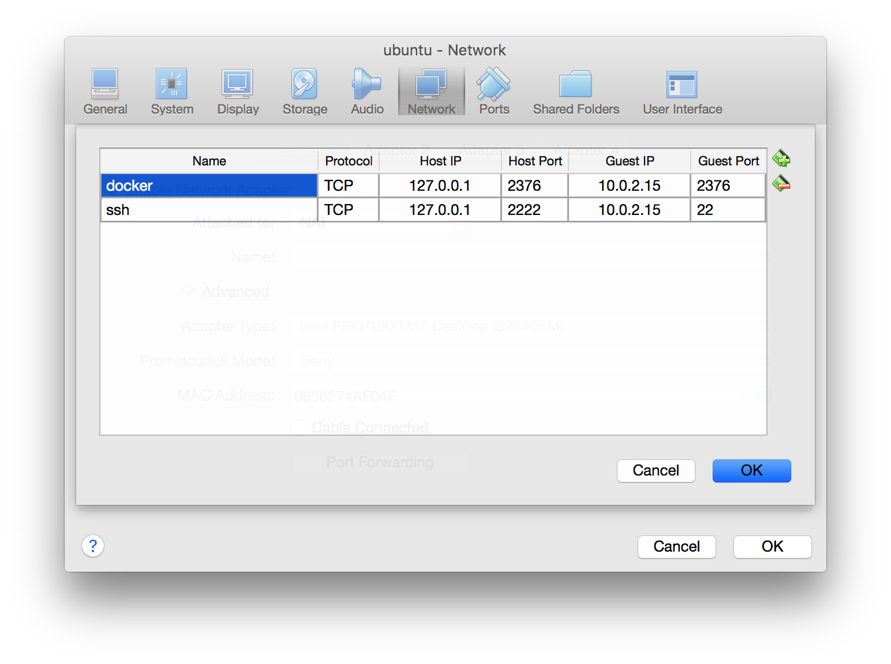

使用 docker-machine 連結 docker engine
======================================

你的 ubuntu user 必須是 sudo 並且使用 sudo 時不需要 password
------------------------------------------------------------

若你不是用 root 帳號，可以透過下列指令，讓你的 linux user 符合條件

```
sudo visudo
```

```
yourname ALL=(ALL) NOPASSWD: ALL
```

輸入 Ctrl-X 離開，你的 user 進行 sudo 時將不再需要打密碼

若是用 vm 且是使用 NAT network
------------------------------

需要設定 port forwarding，分別是 `docker` 以及 `ssh`，如下圖



建立 docker-machine
-------------------

```
docker-machine create \
--driver generic \
--generic-ip-address localhost \
--generic-ssh-user spooky \
--generic-ssh-port 2222 \
ubuntuvm
```

載入環境變數
------------

```
eval "$(docker-machine env ubuntuvm)"
```

如此一來你就可以在你的電腦操做 remote 或是 cloud docker 供應商

測試 docker
-----------

```
docker run --rm hello-world
```
